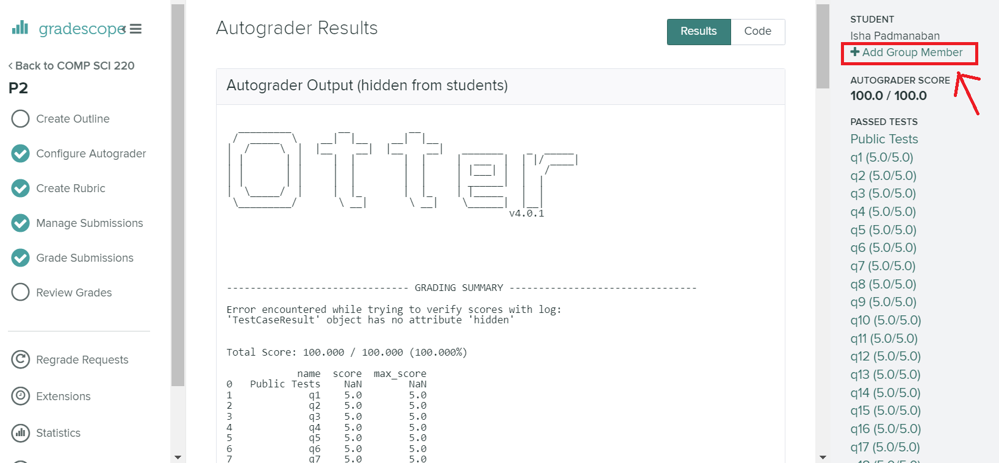
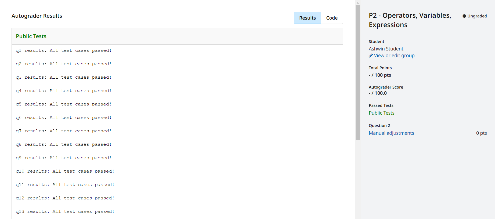
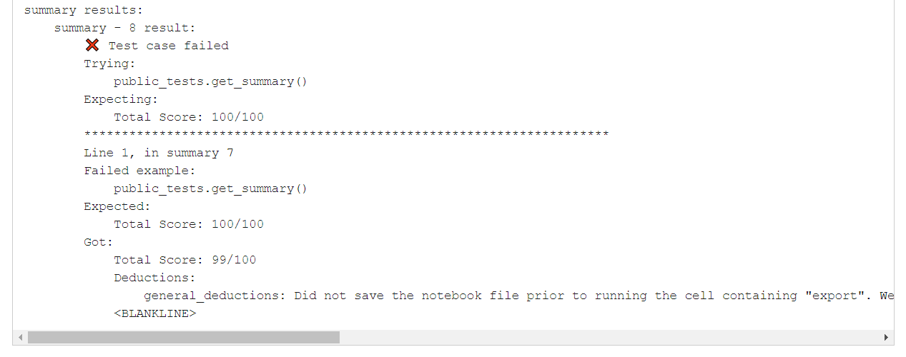

# Project 4 (P4): Pokémon Battle Simulation

## Clarifications/Corrections:

* None yet.

**Find any issues?** Report to us:

- Abhinav Harish <aharish2@wisc.edu>
- Takis Chytas <chytas@wisc.edu>

## Note on Academic Misconduct:
You are **allowed** to work with a partner on your projects. While it is not required that you work with a partner, it is **recommended** that you find a project partner as soon as possible as the projects will get progressively harder. Be careful **not** to work with more than one partner. If you worked with a partner on Lab-P4, you are **not** allowed to finish your project with a different partner. You may either continue to work with the same partner, or work on P4 alone. Now may be a good time to review our [course policies](https://cs220.cs.wisc.edu/s24/syllabus.html).

## Instructions:

In this project, we will focus on conditional statements. To start, create a `p4` directory, and download `p4.ipynb`, `project.py`, `public_tests.py`, `pokemon_stats.csv`, and `type_effectiveness_stats.csv`.

**Note:** Please go through [Lab-P4](https://git.doit.wisc.edu/cdis/cs/courses/cs220/cs220-s24-projects/-/tree/main/lab-p4) before you start the project. The lab contains some very important information that will be necessary for you to finish the project.

You will work on `p4.ipynb` and hand it in. You should follow the provided directions for each question. Questions have **specific** directions on what **to do** and what **not to do**.

After you've downloaded the file to your `p4` directory, open a terminal window and use `cd` to navigate to that directory. To make sure you're in the correct directory in the terminal, type `pwd`. To make sure you've downloaded the notebook file, type `ls` to ensure that `p4.ipynb`, `project.py`, `public_tests.py`, `pokemon_stats.csv`, and `type_effectiveness_stats.csv` are listed. Then run the command `jupyter notebook` to start Jupyter, and get started on the project!

**IMPORTANT**: You should **NOT** terminate/close the session where you run the above command. If you need to use any other Terminal/PowerShell commands, open a new window instead. Keep constantly saving your notebook file, by either clicking the "Save and Checkpoint" button (floppy disk) or using the appropriate keyboard shortcut.

------------------------------

## IMPORTANT Submission instructions:
- Review the [Grading Rubric](https://git.doit.wisc.edu/cdis/cs/courses/cs220/cs220-s24-projects/-/tree/main/p4/rubric.md), to ensure that you don't lose points during code review.

- Login to [Gradescope](https://www.gradescope.com/) and upload the zip file into the P4 assignment.

- If you completed the project with a **partner**, make sure to **add their name** by clicking "Add Group Member"
in Gradescope when uploading the P4 zip file.

-  

   **Warning:** You will have to add your partner on Gradescope even if you have filled out this information in your `p4.ipynb` notebook.
  
- It is **your responsibility** to make sure that your project clears auto-grader tests on the Gradescope test system. Otter test results should be available within forty minutes after your submission (usually within ten minutes). **Ignore** the `-/100.00` that is displayed to the right. You should be able to see both PASS / FAIL results for the 20 test cases, which is accessible via Gradescope Dashboard (as in the image below):

    

- You can view your **final score** at the **end of the page**. If you pass all tests, then you will receive **full points** for the project. Otherwise, you can see your final score in the **summary** section of the test results (as in the image below):

   

   If you want more details on why you lost points on a particular test, you can scroll up to find more details about the test.
